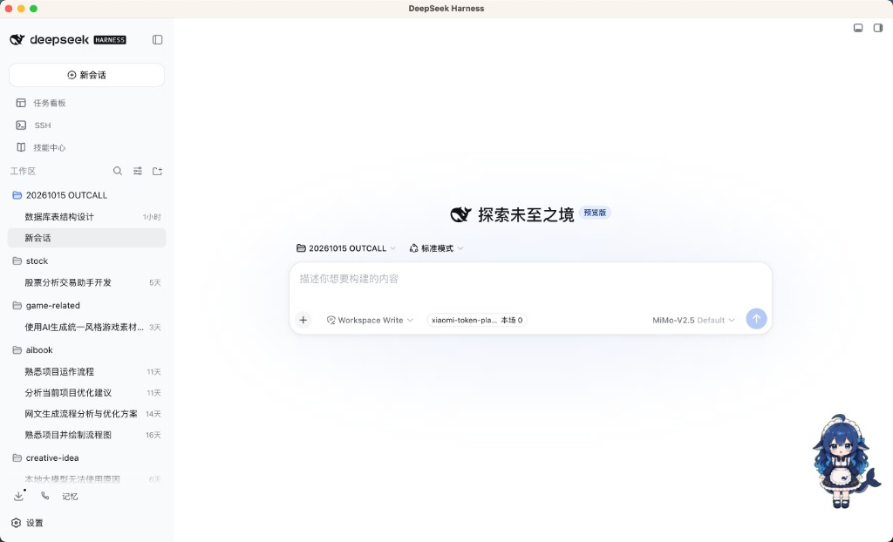

# dsh-skin

macOS 桌面壳：用 Electron 原生窗口加载本机 [DeepSeek Harness](https://www.npmjs.com/package/@deepseek-ai/dsh)（`dsh web`）的本地 Web UI，支持菜单栏托盘显隐，以及退出时干净清理由本壳拉起的子进程。

<p align="center">
  
</p>

<p align="center">
  <em>窗口内即为 DeepSeek Harness 本地 Web UI（会话、工作区、任务看板、SSH、技能中心等）</em>
</p>

## 它解决什么问题

DeepSeek Harness 的 `dsh web` 默认会在系统浏览器中打开本地页面。`dsh-skin` 把它收进独立桌面窗口：

- **独立 App 窗口**，不必依赖浏览器标签页
- **关窗不退出**：隐藏到菜单栏托盘，后台 `dsh` 继续服务
- **一键唤回**：托盘菜单或 Dock 图标即可重新显示
- **干净退出**：托盘「退出」时停止本壳 spawn 的 `dsh`，不误杀你手动起的外部进程
- **不碰数据**：不修改 `~/.dsh`，不改 dsh 本体，也不提供二次封装聊天 UI

## 功能特性

| 能力 | 说明 |
|------|------|
| 自动拉起 / 复用 | 启动时解析本机 `dsh`；目标端口已有服务则直接复用，否则 `dsh web --no-open --port <port>` |
| Loading / 错误页 | 等待 HTTP 就绪时显示 loading；找不到 `dsh`、spawn 失败或超时可重试 |
| 托盘常驻 | 关闭窗口仅 hide；真正退出走托盘菜单 |
| 路径探测 | `PATH` → nvm 常见路径回退 → 环境变量 `DSH_BIN` 显式指定 |
| 端口可配 | 默认 `18789`，可用 `DSH_SKIN_PORT` 覆盖 |

窗口内完整功能（会话、工作区、任务看板、SSH、技能中心、模型选择等）由 DeepSeek Harness 本身提供，本仓库只负责壳层生命周期与窗口管理。

## 架构一览

```
┌─────────────────────────────────────┐
│  dsh-skin（Electron 主进程）          │
│  - 解析 dsh 可执行路径                 │
│  - spawn / 监控 / 停止 dsh            │
│  - Tray：显示窗口 / 退出               │
│  - close → hide；quit → kill dsh     │
└──────────────┬──────────────────────┘
               │ HTTP 就绪后
               ▼
┌─────────────────────────────────────┐
│  BrowserWindow                       │
│  加载 http://127.0.0.1:<port>        │
│  --no-open，不弹系统浏览器             │
└─────────────────────────────────────┘
```

## 依赖

- **Node.js**（建议 LTS）
- **本机已安装 `dsh`**，且可在 shell 中执行，例如：

  ```bash
  npm i -g @deepseek-ai/dsh
  ```

  若 `dsh` 不在当前 `PATH` 中（常见于 nvm），壳会自动尝试 `~/.nvm/versions/node/*/bin/dsh`；也可通过 `DSH_BIN` 显式指定（见下文）。

## 安装与运行

```bash
npm install
npm start      # 启动 Electron 壳
npm test       # 运行单元测试
```

## 环境变量

| 变量 | 默认 | 说明 |
|------|------|------|
| `DSH_SKIN_PORT` | `18789` | `dsh web --port` 使用的端口；若该端口已有 HTTP 服务在监听，则直接复用，不再 spawn |
| `DSH_BIN` | 自动探测 | `dsh` 可执行文件的绝对路径；优先于 `PATH` / nvm 回退 |

示例：

```bash
DSH_SKIN_PORT=19000 DSH_BIN=/path/to/dsh npm start
```

## 行为摘要

- **启动**：解析 `dsh` → 检测端口是否已有服务 → 若无则 `dsh web --no-open --port <port>` → 等待 HTTP 就绪后窗口加载 `http://127.0.0.1:<port>`；等待期间显示 loading 页
- **健康探测**：运行中周期探测本地服务；不可达时显示错误页，可点击重试
- **加载失败 / 渲染崩溃**：先自动重载一次，仍失败则显示错误页
- **关窗 / 最小化**：关闭与**最小化**均隐藏到托盘，App 仍在菜单栏托盘运行，`dsh` 继续服务
- **唤回**：托盘「显示」或 Dock 图标点击可重新显示窗口
- **退出**：托盘「退出」时停止本壳拉起的 dsh **进程组**（SIGTERM→SIGKILL，尽力清理）；若启动时复用了已有端口上的外部 `dsh`，退出时 **不会** 误杀外部进程
- **错误**：找不到 `dsh`、spawn 失败、超时、进程退出或服务不可达等会显示分级文案错误页，可点击重试

## 项目结构

```
dsh-skin/
├── assets/           # 托盘图标、README 截图等
├── src/
│   ├── main.js       # Electron 入口：窗口、托盘、启停编排
│   ├── config.js     # 端口与配置
│   ├── resolve-dsh.js
│   ├── dsh-launcher.js
│   ├── http-ready.js
│   ├── preload.js
│   └── loading.html
├── test/             # node:test 单元测试
└── package.json
```

## 平台与边界

- 首版仅支持 **macOS**
- 不打包内置 dsh、不自动安装 dsh
- 不提供多 profile / 皮肤切换 / 设置页
- 不修改 `~/.dsh` 数据

## 相关链接

- [DeepSeek Harness（npm）](https://www.npmjs.com/package/@deepseek-ai/dsh)
- 设计说明：[`docs/superpowers/specs/2026-09-04-dsh-skin-design.md`](docs/superpowers/specs/2026-09-04-dsh-skin-design.md)
